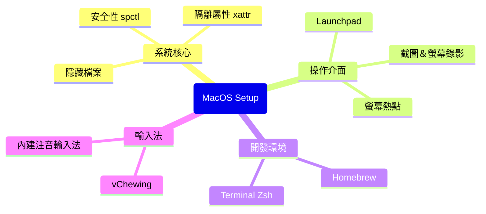
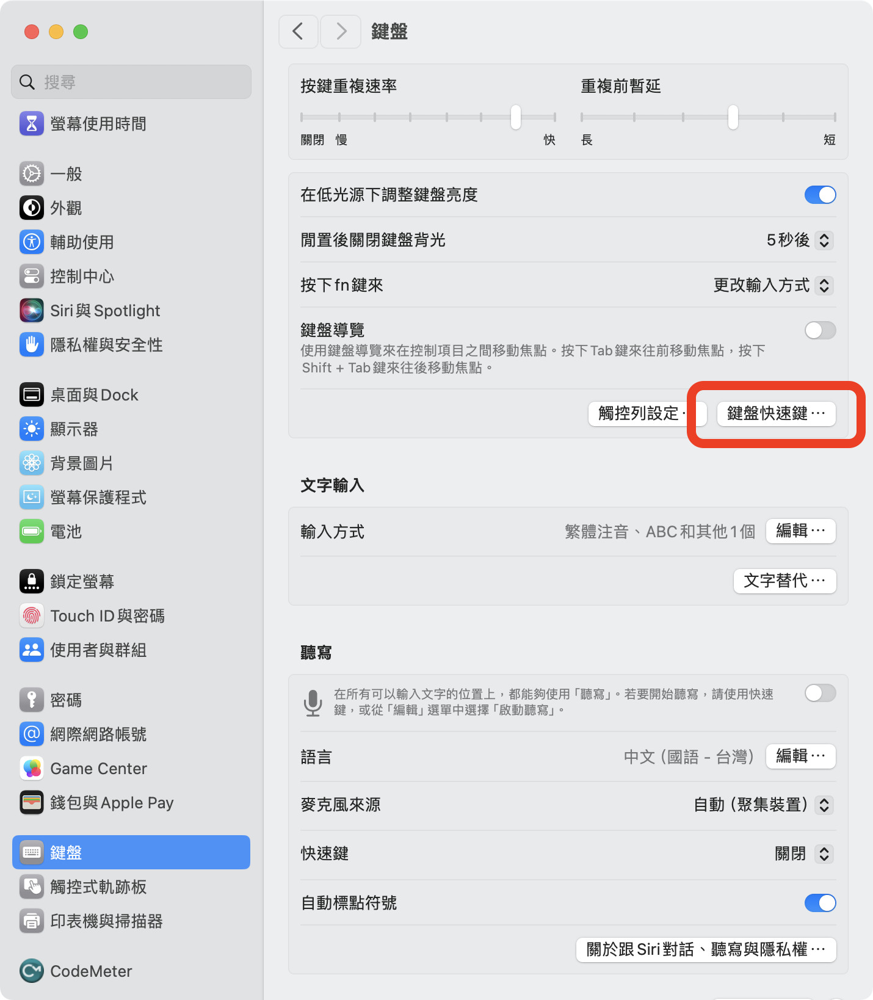
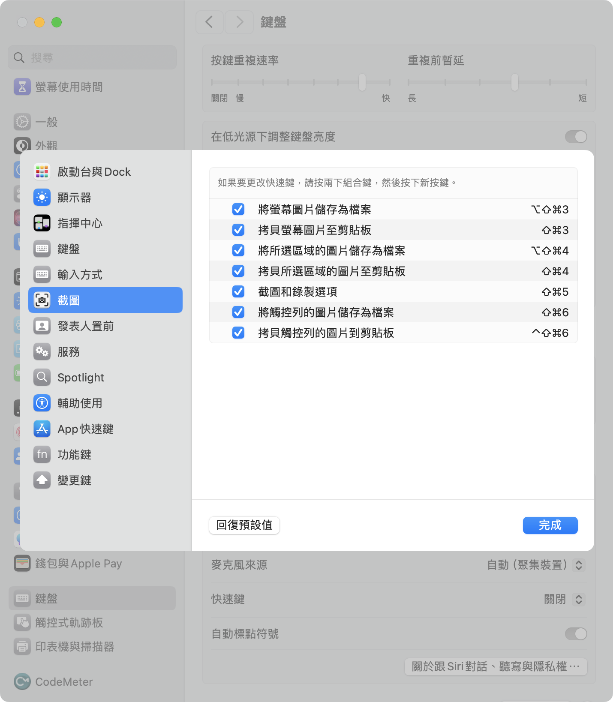

---
aliases:
  - Mac使用手冊
tags:
  - Mac
  - MacOS
  - iOS
---
# 與電腦的戰鬥記錄
---
> **Abstract** : 本文件紀錄 MacOS 的系統調教及常用 App 配置。
> 
> Modified at 2026-03-08_週日
---

---
## 一、 系統核心與安全性設定 (System & Security)

### 1.1 Allow open Unidentified App from Anywhere

功能：允許開啟「任何來源」的應用程式。

```bash
sudo spctl --master-disable
```

終端機會要求輸入使用者密碼，直接輸入並且 Enter (⏎) 即可，並不會顯示在畫面上

> [!TIP] 
> 20241028 : MacOS Sequoia 11.0+ 改為
> 1. 先打開系統設定 → 隱私與安全性，保持此視窗開啟
> 2. 打開終端機輸入上面代碼，輸入密碼後按 Enter (⏎)
> 3. 回到隱私與安全性 → 安全性 → 允許以下來源應用程式 → 選單中出現「任何來源」選項（預設被隱藏的選項）
> 4. 選取任何來源，系統會要求輸入密碼驗證

### 1.2 檔案隔離與附加屬性

**查看屬性：** 

```bash
xattr <路徑>
```

可將欲查看的檔案或目錄拖曳至終端機中以自動補全路徑

**刪除檔案隔離附加屬性：**

```bash
sudo xattr -r -c <檔案或App路徑>
```
### 1.3 隱藏檔案與資料夾管理

**快捷鍵：** `shift (⇧) + cmd (⌘) + .` (暫時切換)

**永久顯示所有隱藏檔案：**

```bash
defaults write com.apple.finder AppleShowAllFiles TRUE; killall Finder
```

若要改回預設的隱藏模式，將第一條的 TRUE 改為 FALSE 即可

**隱藏特定資料夾：** 

```bash
chflags hidden <路徑>
```

**取消隱藏特定資料夾：**

```bash
chflags nohidden <路徑>
```

---
## 二、 操作介面與視覺優化 (UI & UX)

### 2.1 Launchpad 與 Dock 管理

**重置 Launchpad佈局 / 重新啟動 Dock：**

```bash
defaults write com.apple.dock ResetLaunchPad -bool true; killall Dock
```

> [!NOTE] 
> 2025-09-29：MacOS Tahoe 取消 Launchpad ，此代碼已無用（悲），但還是可以在 Dock 莫名故障的時候重新啟動 Dock

### 2.2 強制結束程式

- **快捷鍵：** `cmd(⌘) + opt(⌥) + esc`

### 2.3 螢幕截圖與錄影

###### 去除截圖陰影：

```bash
defaults write com.apple.screencapture disable-shadow -bool true; killall SystemUIServer
```

若要恢復陰影效果，則將 `true` 改為 `false`
###### 內建快捷鍵：

- `command (⌘) + shift (⇧) + 5`：開啟互動式截圖 / 錄影工具


|    動作    |            工具             |
| :------: | :-----------------------: |
|  擷取整個螢幕  |  |
|   擷取視窗   |  |
| 擷取螢幕的一部分 |  |
|  錄製整個螢幕  |  |
| 錄製螢幕的一部分 |  |
- 打開「設定」→ 「鍵盤」→「鍵盤快速鍵⋯」→「截圖」→ 即可查看相關快捷鍵




> [!TIP]
> 螢幕錄影推薦使用 [QuickRecorder](https://github.com/lihaoyun6/QuickRecorder?tab=readme-ov-file)
### 2.4 螢幕熱點 (Hot Corners)：


### 2.5 Launchpad 遺跡：

**MacOS 15 Sequoia**


---

## 三、 開發環境建置 (Development Environment)

### 3.1 Homebrew

#### 3.1.1 在舊電腦上備份 Homebrew 軟體清單

打開 Terminal，輸入以下指令產生 `Brewfile`：

```bash
brew bundle dump --describe --force --file="$HOME/Library/Mobile Documents/com~apple~CloudDocs/Downloads/Brewfile"
```

這個指令會把所有已安裝的 **Formula(CLI 套件)** 和 **Cask(圖形化 App)** 記錄下來，儲存在 iCloud 的下載資料夾內
`~/Library/Mobile Documents/com~apple~CloudDocs/Downloads`

#### 3.1.2 在新電腦安裝 Homebrew

1. 開啟 Terminal，輸入 Homebrew 官方安裝指令：

```bash
/bin/bash -c "$(curl -fsSL https://raw.githubusercontent.com/Homebrew/install/HEAD/install.sh)"
```

2. 安裝完成後，根據終端機內的提示把 brew 的路徑加入你的 shell（通常是 `/opt/homebrew/bin`）
#### 3.1.3 在新電腦使用 Brewfile 一次性還原所有軟體

1. 將之前備份的 `Brewfile` 放入新電腦（例如放到桌面上 `~/Desktop/Brewfile`）
2. 在 Terminal 執行以下指令：
```bash
brew bundle --file=~/Desktop/Brewfile
```
- 這個指令會自動安裝所有在 `Brewfile` 裡的軟體與套件，包括 command-line 工具（formula）與應用程式（cask）

> [!TIP] 匯出軟體清單（選用）
> 如果只想產出純清單來參考，也可以：
> ```bash
> brew list > ~/Desktop/brew-formula-list.txt
> ```
> ---
> ```bash
> brew list --cask > ~/Desktop/brew-cask-list.txt
> ```
### 3.2 Terminal setting

_(進行以下每個操作後都需 `source ~/.zshrc` 後才會生效)_
###### Oh-My-Zsh

```bash
sh -c "$(curl -fsSL https://raw.githubusercontent.com/ohmyzsh/ohmyzsh/master/tools/install.sh)"
```
###### Powerlevel10k

```bash
git clone --depth=1 https://github.com/romkatv/powerlevel10k.git ${ZSH_CUSTOM:-$HOME/.oh-my-zsh/custom}/themes/powerlevel10k
```
then
```bash
nano ~/.zshrc
```
find
`ZSH_THEME="..."`
change it to
`ZSH_THEME="powerlevel10k/powerlevel10k"`
按 `Ctrl + O` → `Enter` → `Ctrl + X` 退出。
then
```bash
p10k configure
```
這時會自動跳出一個**互動式設定介面**。
它會問：「你看得到鑽石符號嗎？」、「你看得到鎖頭嗎？」跟著一步一步選擇自己想要的介面即可。
###### jetbrains-mono-nerd-font

```bash
brew install --cask font-jetbrains-mono-nerd-font
```
###### zsh-autosuggestions

```bash
git clone https://github.com/zsh-users/zsh-autosuggestions ${ZSH_CUSTOM:-~/.oh-my-zsh/custom}/plugins/zsh-autosuggestions
```
###### zsh-syntax-highlighting

```bash
git clone https://github.com/zsh-users/zsh-syntax-highlighting.git ${ZSH_CUSTOM:-~/.oh-my-zsh/custom}/plugins/zsh-syntax-highlighting
```
then
```bash
nano ~/.zshrc
```
find
`plugins=(git)`
change it to
`plugins=(git zsh-autosuggestions zsh-syntax-highlighting)`
按 `Ctrl + O` → `Enter` → `Ctrl + X` 退出。
#### 終端機設定檔備份腳本:

[backup_zsh.sh](script_backup#backup_zsh.sh)

---
## 四、 輸入法與文字處理 (Input Methods)

### 4.1 Mac 輸入法大全

- **切換輸入法：快速切換當前輸入法以及英文**
	- 在使用內建的輸入法如注音輸入法時按一下 `Caps lock` 鍵，即可輸入在英文與當前輸入法之間切換
- **切換所有輸入法：**
	- 預設快捷鍵為按住 `ctrl (⌃) + 空白鍵` 即可在所有輸入法中照順序切換
	- 或是按下 `fn (地球鍵)` 來切換所有輸入法
- **轉換半寬／全寬字型：**
  注音模式下輸入皆為「全形」，英文模式下皆為「半形」，在注音模式下可選取文字後點選 Menubar 中輸入法選項裡面切換全形半形。

> [!NOTE] 2026-02-21 :
> 已從內建注音輸入法跳槽至 vChewing 唯音輸入法。
> 如何備份自定義辭典與設定檔請看 [vChewing_manager.sh](script_backup#vChewing_manager.sh)

---
## 五、 Browsers

### 5.1 Youtube 擋廣告

[uBlock Origin](https://ublockorigin.com/)：自訂靜態規則

```js
youtube.com##+js(set, yt.config_.openPopupConfig.supportedPopups.adBlockMessageViewModel, false)
youtube.com##+js(set, Object.prototype.adBlocksFound, 0)     
youtube.com##+js(set, ytplayer.config.args.raw_player_response.adPlacements, [])
youtube.com##+js(set, Object.prototype.hasAllowedInstreamAd, true)
```

### 5.2 Firefox 瀏覽器設定檔

在 Firefox 網址列輸入：`about:config`

| Formula                             |        Value        |
| :---------------------------------- | :-----------------: |
| browser.gesture.pinch.in            | cmd_fullZoomReduce  |
| browser.gesture.pinch.in.shift      |  cmd_fullZoomReset  |
| browser.gesture.pinch.latched       |        true         |
| browser.gesture.pinch.out           | cmd_fullZoomEnlarge |
| browser.gesture.pinch.out.shift     |  cmd_fullZoomReset  |
| browser.tabs.closeTabByDblclick     |        true         |
| browser.tabs.closeWindowWithLastTab |        false        |
### 5.3 Enhancer for YouTube

> [!NOTE] 2025-10-23 at Arc
> 
> ```json
> {
>   "version": "3.0.14",
>   "settings": {
>     "applyvideofilters": false,
>     "backdropcolor": "#000000",
>     "backdropopacity": 85,
>     "blackbars": false,
>     "blockautoplay": false,
>     "blockhfrformats": false,
>     "blockwebmformats": false,
>     "boostvolume": false,
>     "cinemamode": false,
>     "cinemamodewideplayer": false,
>     "controlbar": {
>       "active": false,
>       "autohide": false,
>       "centered": true,
>       "position": "absolute"
>     },
>     "controls": [
>       "loop",
>       "reverse-playlist",
>       "speed-minus",
>       "speed-plus",
>       "screenshot"
>     ],
>     "controlsvisible": true,
>     "controlspeed": true,
>     "controlspeedmousebutton": false,
>     "controlvolume": false,
>     "controlvolumemousebutton": false,
>     "convertshorts": false,
>     "customcolors": {
>       "--dimmer-text": "#cccccc",
>       "--hover-background": "#232323",
>       "--main-background": "#111111",
>       "--main-color": "#ff0033",
>       "--main-text": "#eff0f1",
>       "--second-background": "#181818",
>       "--shadow": "#000000"
>     },
>     "customcss": "",
>     "customscript": "",
>     "customtheme": false,
>     "darktheme": true,
>     "date": 1745134330277,
>     "defaultvolume": false,
>     "disableautoplay": false,
>     "executescript": false,
>     "expanddescription": false,
>     "filter": "none",
>     "griditemsperrow": {
>       "channel": {
>         "shorts": {
>           "apply": false,
>           "count": 5
>         },
>         "videos": {
>           "apply": false,
>           "count": 4
>         }
>       },
>       "posts": {
>         "apply": false,
>         "count": 4
>       },
>       "shorts": {
>         "apply": false,
>         "count": 8
>       },
>       "videos": {
>         "apply": false,
>         "count": 4
>       }
>     },
>     "hidecardsendscreens": false,
>     "hidechat": false,
>     "hidecomments": false,
>     "hiderelated": false,
>     "hideshorts": false,
>     "ignoreplaylists": true,
>     "ignorepopupplayer": true,
>     "localecode": "zh_TW",
>     "localedir": "ltr",
>     "miniplayer": false,
>     "miniplayerposition": "top-left",
>     "miniplayersize": "480x270",
>     "newestcomments": true,
>     "overridespeeds": true,
>     "pauseforegroundtab": false,
>     "pausevideos": false,
>     "popuplayersize": "640x360",
>     "previousversion": "3.0.13",
>     "qualityembeds": "medium",
>     "qualityembedsfullscreen": "hd1080",
>     "qualityplaylists": "hd720",
>     "qualityplaylistsfullscreen": "hd1080",
>     "qualityvideos": "hd720",
>     "qualityvideosfullscreen": "hd1080",
>     "reload": true,
>     "reversemousewheeldirection": false,
>     "selectquality": false,
>     "selectqualityfullscreenoff": false,
>     "selectqualityfullscreenon": false,
>     "speed": 1,
>     "speedvariation": 0.25,
>     "stopvideos": false,
>     "theatermode": false,
>     "theme": "default-dark",
>     "themevariant": "dark-red.css",
>     "update": 1761660999254,
>     "vendorthemevariant": "youtube-deep-dark.css",
>     "videofilters": {
>       "blur": 0,
>       "brightness": 100,
>       "contrast": 100,
>       "grayscale": 0,
>       "inversion": 0,
>       "rotation": 0,
>       "saturation": 100,
>       "sepia": 0
>     },
>     "volume": 50,
>     "volumemultiplier": 2,
>     "volumevariation": 5,
>     "whatsnew": true,
>     "wideplayer": false,
>     "wideplayerviewport": false
>   }
> }
> ```

> [!NOTE] 2025-10-23 at Firefox
> 
> ```json
> {"version":"2.0.130.1","settings":{"blur":0,"brightness":100,"contrast":100,"grayscale":0,"huerotate":0,"invert":0,"saturate":100,"sepia":0,"applyvideofilters":false,"backgroundcolor":"#000000","backgroundopacity":85,"blackbars":false,"blockautoplay":false,"blockhfrformats":false,"blockwebmformats":false,"boostvolume":false,"cinemamode":false,"cinemamodewideplayer":false,"controlbar":{"active":false,"autohide":false,"centered":true,"position":"absolute"},"controls":["loop","reverse-playlist","speed-minus","speed-plus","screenshot"],"controlsvisible":true,"controlspeed":true,"controlspeedmousebutton":false,"controlvolume":false,"controlvolumemousebutton":false,"convertshorts":false,"customcolors":{"--main-color":"#ff0033","--main-background":"#111111","--second-background":"#181818","--hover-background":"#232323","--main-text":"#eff0f1","--dimmer-text":"#cccccc","--shadow":"#000000"},"customcssrules":"","customscript":"","customtheme":false,"darktheme":true,"date":1745134330277,"defaultvolume":false,"disableautoplay":false,"executescript":false,"expanddescription":false,"filter":"none","hidecardsendscreens":false,"hidechat":false,"hidecomments":false,"hiderelated":false,"hideshorts":false,"ignoreplaylists":true,"ignorepopupplayer":true,"localecode":"zh_TW","localedir":"ltr","message":false,"miniplayer":false,"miniplayerposition":"top-left","miniplayersize":"480x270","newestcomments":true,"overridespeeds":true,"pauseforegroundtab":false,"pausevideos":false,"popuplayersize":"640x360","qualityembeds":"medium","qualityembedsfullscreen":"hd1080","qualityplaylists":"hd720","qualityplaylistsfullscreen":"hd1080","qualityvideos":"hd720","qualityvideosfullscreen":"hd1080","reload":false,"reversemousewheeldirection":false,"selectquality":false,"selectqualityfullscreenoff":false,"selectqualityfullscreenon":false,"speed":1,"speedvariation":0.25,"stopvideos":false,"theatermode":false,"theme":"default-dark","themevariant":"dark-red.css","update":1745134330277,"volume":50,"volumemultiplier":2,"volumevariation":5,"wideplayer":false,"wideplayerviewport":false}}
> ```

---
## 六、 Mac 熱點分享與除錯 (Internet Sharing)

> [!NOTE] 使用情境
> 讓 Mac 透過 **有線網路（Ethernet）** 上網，並透過 **Wi-Fi** 分享給其他裝置（如手機、iPad、筆電）使用。此章節包含 GUI 設定流程與 CLI 底層除錯紀錄。

### 6.1 透過系統介面設定 (GUI)

1. 開啟「系統設定」 → 「通用」 → 「共享」。
2. 點選「網際網路共享」右側的 `i` 圖示，設定以下選項：
   * **分享來源：** USB 有線網卡（例如 `en5`）
   * **給其他裝置使用：** 勾選 `Wi-Fi`
3. 點選下方「Wi-Fi 選項」：
   * **網路名稱 (SSID)：** 自訂熱點名稱（如 `MyMacHotspot`）
   * **頻道：** 建議選擇 `6` 或 `11`
   * **安全性：** `WPA2/WPA3 個人`
   * **密碼：** 輸入 8 碼以上密碼


4. 返回共享設定畫面，開啟「網際網路共享」開關。
5. 成功啟動時，狀態列的 Wi-Fi 圖示會改變：


### 6.2 終端機除錯指令 (CLI 檢查狀態)

如果介面顯示開啟，但裝置卻連不上，可使用以下指令檢查底層狀態：

* **查詢網路硬體介面名稱：**
```bash
networksetup -listallhardwareports
```


* **查看 Wi-Fi 詳細狀態：**
```bash
sudo wdutil NOTE
```


*(檢查輸出中是否包含 `Op Mode: HOSTAP`、正確的 `SSID` 以及 `IPv4 Address: 192.168.2.1`)*
* **列出目前是否有裝置連上 (NAT 網段)：**
```bash
arp -a
```


* **檢查是否有活躍的 NAT 路由：**
```bash
netstat -an | grep 192.168.2
```


### 6.3 常見異常與系統級清理

**異常一：Op Mode 為 HOSTAP，但 SSID 與 IPv4 仍為 None**
這代表系統的分享服務卡死了，可以直接透過 `launchctl` 重啟核心服務：

```bash
sudo launchctl bootout system /System/Library/LaunchDaemons/com.apple.InternetSharing.plist 2>/dev/null

sudo launchctl bootstrap system /System/Library/LaunchDaemons/com.apple.InternetSharing.plist

```

*(執行後可嘗試重新關閉再開啟網際網路共享 UI 開關)*

**異常二：廣播出的熱點名稱變成「MacBook Pro」且不需密碼**
這是因為被 Apple 內建的「Instant Hotspot」功能干擾。

* **解法：** 前往「系統設定」 → 「Apple ID」 → 「iCloud」 → 「Handoff」將其關閉；並在「網路」 → 「Wi-Fi」中關閉「允許其他裝置加入熱點」，再重新設定共享。

> [!IMPORTANT] 終極清理手段 (重置所有網路設定)
> 若上述方法皆無效，可強制刪除相關的 `.plist` 設定檔並重開機（**注意：這會清空部分網路設定，請謹慎使用**）：
> ```bash
> sudo rm /Library/Preferences/SystemConfiguration/com.apple.nat.plist
> sudo rm /Library/Preferences/SystemConfiguration/preferences.plist
> sudo rm /Library/Preferences/SystemConfiguration/NetworkInterfaces.plist
> sudo rm /Library/Preferences/SystemConfiguration/com.apple.airport.preferences.plist
> sudo reboot
> 
> ```
> 
> 

### 6.4 替代方案：使用 `create_ap` (CLI 手動建立熱點)

如果 macOS 內建的 GUI 徹底罷工，我們可以直接使用第三方 CLI 工具手動建立熱點：

```bash
# 安裝 create_ap
brew install create_ap

# 執行建立熱點 (格式：sudo create_ap <分享出去的網卡> <來源網卡> <SSID> <密碼>)
sudo create_ap en0 en5 MyRealHotspot mysecurepassword

```

> [!WARNING] 備註：向 Apple 回報 Bug
> 該問題曾在 macOS 15.3.2 發生過。若遇到 `Wi-Fi enters HOSTAP mode but no SSID is broadcast...` 的狀況，可至 [Apple Feedback Assistant](https://feedbackassistant.apple.com) 提交回報。

---

